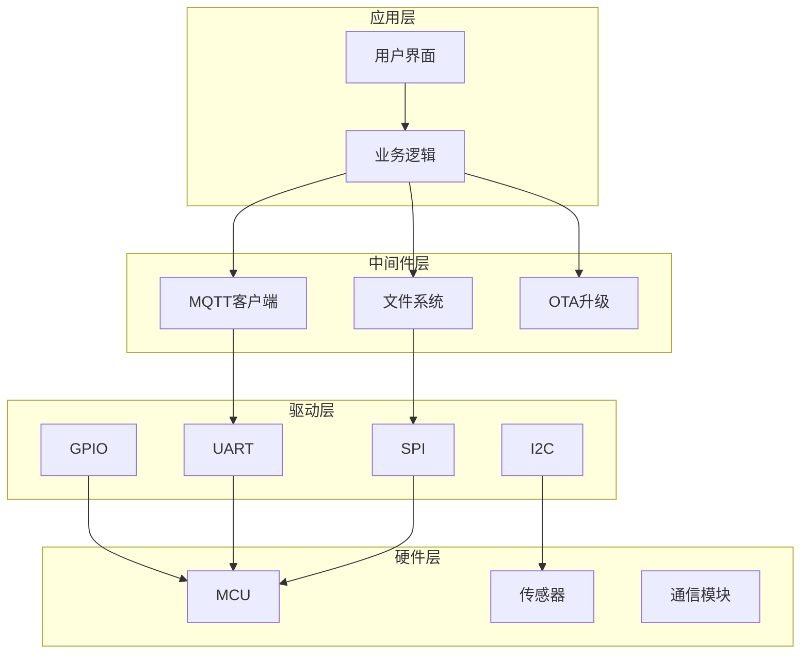

# 嵌入式项目管理

## 核心概念

- **项目管理** - 规划、执行、监控项目
- **需求分析** - 明确项目要做什么
- **风险管理** - 识别和应对风险
- **质量保证** - 确保产品质量

---

## 一、项目流程

### 1.1 开发流程

```
需求分析 → 方案设计 → 详细设计 → 编码实现 → 测试验证 → 发布维护
```

| 阶段 | 输出 | 时间占比 |
|------|------|----------|
| 需求分析 | 需求文档 | 10-15% |
| 方案设计 | 方案文档 | 15-20% |
| 详细设计 | 设计文档 | 15-20% |
| 编码实现 | 源代码 | 20-25% |
| 测试验证 | 测试报告 | 15-20% |
| 发布维护 | 产品 | 5-10% |

---

### 1.2 敏捷开发

**Scrum流程：**
```
Product Backlog → Sprint Planning → Sprint (2-4周) → Daily Standup → Sprint Review → Sprint Retrospective
```

**看板方法：**
```
待办 → 进行中 → 测试 → 完成
```

---

## 二、需求分析

### 2.1 需求类型

| 类型 | 说明 | 示例 |
|------|------|------|
| 功能需求 | 系统做什么 | 温度采集、WiFi传输 |
| 非功能需求 | 质量属性 | 响应时间、功耗 |
| 约束条件 | 限制条件 | 成本、尺寸、认证 |

---

### 2.2 需求文档模板

```markdown
# 项目需求文档

## 1. 项目概述
- 项目名称
- 项目目标
- 项目范围

## 2. 功能需求
### 2.1 需求1
- 描述
- 优先级
- 验收标准

## 3. 非功能需求
- 性能
- 可靠性
- 安全性

## 4. 约束条件
- 硬件约束
- 成本约束
- 时间约束

## 5. 接口需求
- 硬件接口
- 软件接口
- 通信接口
```

---

## 三、方案设计

### 3.1 方案选型

**选型因素：**
| 因素 | 考虑点 |
|------|--------|
| 性能 | CPU、内存、外设 |
| 成本 | 芯片价格、开发成本 |
| 生态 | 工具链、社区、文档 |
| 供应 | 供货稳定性、替代方案 |
| 功耗 | 电池寿命、散热 |

---

### 3.2 方案对比表

| 方案 | ESP32 | STM32+WiFi | 树莓派 |
|------|-------|------------|--------|
| 性能 | 中 | 中 | 高 |
| 成本 | 低 | 中 | 高 |
| 功耗 | 低 | 低 | 高 |
| WiFi | 内置 | 需模块 | 内置 |
| 开发难度 | 低 | 中 | 中 |
| 适用场景 | IoT | 工业 | 网关 |

---

## 四、详细设计

### 4.1 架构设计



---

### 4.2 模块设计

```c
// 模块接口设计
typedef struct {
    int (*init)(void);
    int (*deinit)(void);
    int (*read)(void *data, int len);
    int (*write)(void *data, int len);
    int (*ioctl)(int cmd, void *arg);
} module_ops_t;

// 模块注册
int module_register(const char *name, module_ops_t *ops);
module_ops_t *module_get(const char *name);
```

---

## 五、编码规范

### 5.1 命名规范

| 元素 | 规范 | 示例 |
|------|------|------|
| 变量 | 小写+下划线 | sensor_value |
| 函数 | 小写+下划线 | read_sensor_data |
| 宏 | 大写+下划线 | MAX_BUFFER_SIZE |
| 类型 | 小写+下划线+t | sensor_data_t |
| 结构体 | 小写+下划线 | sensor_config |

---

### 5.2 文件组织

```
project/
├── src/
│   ├── main.c
│   ├── app/
│   │   ├── app_init.c
│   │   └── app_main.c
│   ├── drivers/
│   │   ├── gpio.c
│   │   ├── uart.c
│   │   └── spi.c
│   ├── middleware/
│   │   ├── mqtt.c
│   │   └── ota.c
│   └── utils/
│       ├── debug.c
│       └── timer.c
├── include/
│   ├── app/
│   ├── drivers/
│   ├── middleware/
│   └── utils
├── tests/
└── docs/
```

---

### 5.3 代码审查清单

```
□ 命名规范
□ 注释完整
□ 错误处理
□ 内存管理
□ 边界检查
□ 线程安全
□ 资源释放
□ 性能考虑
□ 可测试性
□ 可维护性
```

---

## 六、版本管理

### 6.1 分支策略

```
main ────────────────────────────→
  │                          ↑
  │    ┌─feature─┐          │
  └────┤         ├─merge────┘
       └─────────┘

develop ──────────────────────────→
  │           ↑     ↑
  │    ┌─feature─┐ │
  └────┤         ├─┘
       └─────────┘
```

---

### 6.2 提交规范

```
<type>(<scope>): <subject>

类型：
- feat: 新功能
- fix: 修复
- docs: 文档
- style: 格式
- refactor: 重构
- test: 测试
- chore: 构建/工具
```

---

## 七、测试策略

### 7.1 测试层次

| 层次 | 范围 | 工具 |
|------|------|------|
| 单元测试 | 函数/模块 | Unity, CMocka |
| 集成测试 | 模块交互 | 自定义 |
| 系统测试 | 完整系统 | 测试台 |
| 验收测试 | 用户需求 | 现场测试 |

---

### 7.2 测试用例

```c
void test_sensor_read(void) {
    // 准备
    sensor_init();

    // 执行
    int value = sensor_read();

    // 验证
    TEST_ASSERT_GREATER_OR_EQUAL(0, value);
    TEST_ASSERT_LESS_OR_EQUAL(100, value);
}
```

---

## 八、风险管理

### 8.1 风险识别

| 风险类型 | 示例 | 影响 |
|----------|------|------|
| 技术风险 | 芯片缺货 | 延期 |
| 进度风险 | 需求变更 | 延期 |
| 质量风险 | Bug多 | 返工 |
| 人员风险 | 关键人员离职 | 延期 |

---

### 8.2 风险应对

| 策略 | 说明 | 示例 |
|------|------|------|
| 规避 | 消除风险 | 选择成熟技术 |
| 转移 | 转嫁风险 | 外包部分模块 |
| 减轻 | 降低影响 | 增加测试 |
| 接受 | 接受风险 | 预留缓冲时间 |

---

## 九、文档管理

### 9.1 文档类型

| 文档 | 内容 | 时机 |
|------|------|------|
| 需求文档 | 需求描述 | 项目初期 |
| 设计文档 | 架构设计 | 设计阶段 |
| 接口文档 | API说明 | 编码阶段 |
| 测试文档 | 测试用例 | 测试阶段 |
| 用户手册 | 使用说明 | 发布阶段 |
| 维护手册 | 维护指南 | 维护阶段 |

---

## 十、成本估算

### 10.1 成本组成

```
总成本 = 硬件成本 + 开发成本 + 测试成本 + 维护成本
```

| 项目 | 占比 | 说明 |
|------|------|------|
| 硬件 | 30-40% | 芯片、PCB、元器件 |
| 开发 | 30-40% | 人力、工具 |
| 测试 | 10-15% | 设备、人力 |
| 维护 | 10-20% | 更新、支持 |

---

### 10.2 工时估算

| 模块 | 估算方法 | 示例 |
|------|----------|------|
| 类比法 | 参考类似项目 | 5人/月 |
| 专家法 | 专家判断 | 3人/月 |
| 三点法 | 乐观+悲观+可能 | (2+8+4)/3=4.7人/月 |

---

## 附录：工具推荐

| 类别 | 工具 | 用途 |
|------|------|------|
| 项目管理 | Jira, Trello, 飞书 | 任务跟踪 |
| 文档 | Confluence, 语雀, Notion | 文档协作 |
| 设计 | Draw.io, Visio, ProcessOn | 架构图 |
| 版本 | Git, GitHub, GitLab | 代码管理 |
| CI/CD | GitHub Actions, Jenkins | 自动化 |

---

## 相关链接

- [[Git版本控制]] - 版本管理
- [[自动化测试]] - 测试方法
- [[嵌入式架构设计]] - 架构设计
