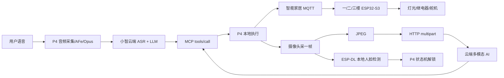
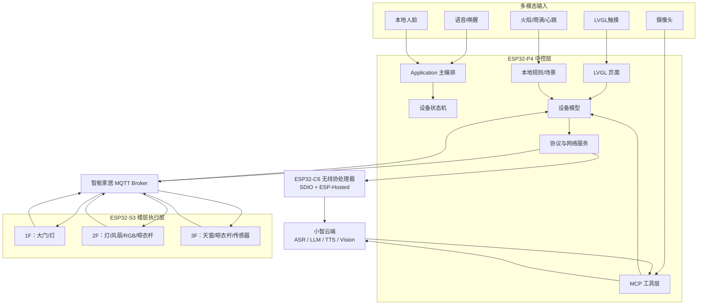

# 14 · 评委拷打与场景话术

> **分工**  
> - **[[12-答辩准备]]**：技术百科（驱动/协议/链路怎么答）  
> - **[[13-答辩流程]]**：上场演示口播  
> - **本文 14**：定位怎么讲、场景怎么答、评委真实拷打题  
>  
> 原则：评委通常不会人身攻击；真正危险的是**套壳质疑、场景空洞、指标虚、边界不清**。

---

## 0. 先定调：我们到底突出什么？

### 0.1 一句话定位（开场/被问“你们做什么”时用）

> 我们做的是 **智能交互驱动的 AIoT 多模态家居中控**：  
> 把 **感知 → 交互 → 决策 → 分布式执行 → 状态回显** 做成可演示、可扩展的闭环。  
> 不是单板点灯，也不是只能聊天的音箱。

### 0.2 要不要死磕“交互感知决策”四个字？

**要贴题，但不要当口号堆。**

| 说法 | 建议 |
|---|---|
| 只喊“感知交互决策服务” | 空，像背赛题 |
| 只讲技术栈很长 | 散，评委抓不住卖点 |
| **用闭环讲贴题** | 推荐：每个词都对应你系统里的真模块 |

**标准答法：**

> 我们贴的是乐鑫赛道第五选题「智能交互驱动的 AIoT」。  
> 不是四个词分别堆功能，而是一条闭环：  
> - **感知**：火焰/雨滴、人脸、设备心跳与环境状态  
> - **交互**：语音、触屏、人脸登录  
> - **连接**：P4 经 C6 上网 + 三层 S3 MQTT  
> - **服务/决策**：MCP 语义工具 + 本地规则（火警/雨天/场景）  
> - **执行与回显**：楼层从机动作 → 心跳/resp → 设备模型 → UI  
>  
> 所以核心不是“会聊天”，而是 **交互之后整栋楼协同执行，并且状态看得见、安全关得住**。

### 0.3 项目真正该突出的 4 个硬点（按优先级）

1. **多模态交互入口统一落到同一控制面**（语音/触屏/人脸 → 同一 MQTT/设备模型）  
2. **异构分布式架构**（P4 中控 + C6 无线 + S3×3 楼层执行）  
3. **语义决策与本地自治分层**（云端 MCP 理解意图，本地规则保安全）  
4. **工程闭环**（二进制协议、Flag-Driven 从机、心跳离线、UI 异步刷新）

> 金句：  
> **小智解决“会说话”；我们解决“说完以后房子怎么协同做、怎么回显、怎么本地兜底”。**

### 0.4 别突出 / 少吹的点

| 少吹 | 原因 |
|---|---|
| 自研大模型 | 没有 |
| 毫秒级安全闭环 | 自动模式约 1s，传感 500ms，要诚实 |
| 替代米家生态 | 竞赛原型，不是消费产品 |
| 麦克风阵列（若无） | 以 ES8311 实装为准 |
| smoke=烟雾 | 实际是火焰 mV 兼容字段 |

---

## 1. 30 秒 / 60 秒项目介绍（背熟）

### 1.1 30 秒版

> 本作品面向三层建筑模型的 AIoT 中控。  
> ESP32-P4 负责触屏、语音 AI、本地人脸和规则决策；板载 C6 提供 Wi-Fi；三台 ESP32-S3 做各层执行与传感。  
> 用户可通过语音、触屏、人脸进入系统；意图经 MCP 校验后，由 MQTT 二进制协议下发到楼层节点，状态再回显到中控。  
> 火警、雨天等安全场景以本地规则为主，形成感知—决策—执行闭环。

### 1.2 60 秒版（可接在演示前）

> 老师好。我们做的是智能交互驱动的多模态家居中控，对应第五选题。  
>  
> 硬件上是 P4 中控 + C6 无线协处理 + 三层 S3 从机。  
> 软件上有两条网络通道：小智云负责语音理解，智能家居 MQTT 负责设备控制。  
>  
> 交互上支持语音、LVGL 触屏和本地人脸；决策上云端做语义工具调用，本地做火警/雨天/场景编排；执行上各层 S3 用 Flag-Driven 方式刷新 GPIO/PWM/ADC。  
>  
> 我们强调的不是单点功能，而是 **交互可多模、控制可分布、安全可本地、状态可回显**。

---

## 2. 应用场景怎么说（高频）

> 原则：**先给 1 个主场景，再给 2 个迁移场景，最后主动说边界。**  
> 不要报一长串“智慧城市/养老/工业互联网”空话。

### 2.1 主场景（最贴作品）

**多层住宅 / 宿舍楼宇模型中控**

> 主场景是三层家居或宿舍楼模型：一层门禁与公共照明，二层居住与氛围，三层阳台传感与天窗晾衣。  
> 用户回家可用人脸解锁并自动回家场景；日常可用语音连续控制多设备，或用触屏精确操作；下雨自动收衣关窗，火焰触发逃生联动。  
> 这解决的是“设备分散、入口不统一、安全依赖人值守”的问题。

### 2.2 可迁移场景（点到即可，各 2 句）

| 场景                | 怎么映射到你的架构                        | 别说过头          |
| ----------------- | -------------------------------- | ------------- |
| **学生宿舍/公寓管理**     | 中控=值班屏；楼层节点=房间执行；人脸=授权进入；告警=安全联动 | 别说已部署物业系统     |
| **小型商铺/工作室 值班**   | 触屏总览 + 语音免手操作 + 离线告警             | 别说替代专业消防系统    |
| **温室/大棚环境监测架构复用** | 传感上报 + 规则自动收纳/通风 + 远程状态          | 别说已做农业定植算法    |
| **IoT 网关教学/原型**   | P4 当边缘网关，S3 当子设备，协议可复制扩层         | 这是架构价值，不是量产声明 |

**统一收口句：**

> 作品首先完整服务家居中控主场景；上述是同一套「中控决策 + 分布式节点 + 本地规则」架构的迁移方向，不是声称已经做成行业成品。

### 2.3 评委问“有什么用 / 谁会用”

> 直接用户是需要统一管控多区域设备的家庭或宿舍管理者。  
> 演示对象是三层模型，但角色清晰：中控做人机与决策，楼层节点做执行与感知。  
> 对用户的价值是：少记一堆开关、异常能自动处置、状态在一块屏上看得到。

### 2.4 评委问“和米家/HomeAssistant/天猫精灵比”

> 我们不是消费级生态替代，也不是成品 App 竞赛。  
> 差异在于：协议与节点可完全讲解、可按楼层复制扩展，边缘侧保留本地规则与人脸，适合作为 AIoT 中控与网关原型。  
> 米家强在生态与产品化；我们强在 **可拆解的嵌入式系统架构与多模态闭环**。

### 2.5 评委问“商业化吗 / 成本”

> 当前定位是竞赛与教学向可运行原型。  
> 成本结构大致是：P4 中控板 + 显示触控与音视频外设 + 每层一块 S3 与执行器。  
> 若产品化，需要补安全认证、OTA、设备发现与权限体系；这些我们已在不足与展望里承认，没有包装成已量产。

---

## 3. 评委真实拷打清单（按杀伤力排序）

> 用法：闭眼抽题，45 秒内答完；答不出就回 [[12-答辩准备]] 对应章节补技术细节。

### A. 定位与套壳（最容易被问）

**A1. 这不就是开源小智加点控制吗？**

> 小智我们用了，它是语音 Agent 底座。  
> 我们的交付是全屋控制面：异构中控、三套从机、自研二进制协议、设备模型与中控 UI、本地人脸与安全规则。  
> 小智是嘴；脑、神经、四肢和本地反射弧是我们做的。  
> 现场可以先不靠语音，只靠触屏和本地规则把三层控制跑通。

**A2. 创新点到底在哪？一句话说。**

> 把多模态交互收敛到统一设备控制面，并在云端语义与本地自治之间分层：  
> 云端负责理解，本地负责执行编排与安全兜底，主从用可扩展二进制协议协同。

**A3. 为什么算第五选题，不是普通智能家居 Demo？**

> 第五选题强调智能交互驱动的 AIoT 闭环。  
> 我们具备语音/触屏/人脸多模态交互，Wi-Fi/MQTT 连接，家居控制与安全服务，并且核心跑在 ESP32-P4/S3 上，不是单外设实验。

**A4. 你这个系统最核心的科学/工程问题是什么？**

> 多输入源（语音、UI、传感器、人脸）如何在资源受限 MCU 上统一决策，并可靠地驱动分布式执行节点，同时保证 UI 状态一致与安全路径不完全依赖云。

---

### B. 架构与选型

**B1. 为什么要 P4 + 三台 S3？一台 S3 不够吗？**

> 一台 S3 能做小型 demo，但扛不住高分辨率 HMI + 摄像头人脸 + 全屋分布式 IO 同时做强。  
> P4 适合显示/视觉/音频中枢；S3 靠近楼层做无线与执行，线束短、可按层扩展。  
> 这是中央决策 + 楼层执行的分工，不是为了堆板子。

**B2. P4 没有 Wi-Fi 怎么办？**

> P4 无原生 Wi-Fi，板载 C6 经 SDIO + ESP-Hosted 虚拟成网卡；上层仍走 Station 联网。  
> 从机 S3 自带 Wi-Fi。这是乐鑫官方典型异构方案。

**B3. 为什么不全部 GPIO 接到 P4？**

> 线束、IO 数量、部署距离和扩展性都差。楼层节点化后，坏一层不影响理解整架构，也更接近真实楼宇/房间部署。

**B4. 为什么设备协议用二进制不是 JSON？**

> 命令包约 8 字节，解析确定、动态内存少，适合 MCU。  
> 代价是可读性，所以用共享头文件、版本与长度校验、预留字段。云端 AI 通道仍可用 JSON，那是另一条业务通道。

**B5. 两套 MQTT/网络会不会过度设计？**

> 不。小智云通道承载音频与 LLM/MCP；智能家居通道承载设备实时控制与心跳。  
> 职责分离后，聊天通不等于设备通，排障也清晰。这是有意设计，不是重复造轮子。

---

### C. 交互 / 感知 / 决策（贴题深挖）

**C1. 你们的“智能交互”体现在哪？**

> 三种入口：  
> 1）语音：自然语言 → MCP 工具 → 多设备编排；  
> 2）触屏：LVGL 七页精确控制与总览；  
> 3）人脸：本地识别触发登录与回家场景。  
> 三者最终落到同一设备模型与 MQTT 执行路径，而不是三套互不相干逻辑。

**C2. “感知”有哪些？是不是只有传感器？**

> 感知分三类：  
> - 环境感知：三楼火焰/雨滴 ADC  
> - 人机感知：触摸、语音、摄像头人脸  
> - 系统感知：节点心跳、在线离线、设备状态快照  
> 决策既看环境，也看系统健康状态。

**C3. “决策”在云端还是本地？**

> 分层决策：  
> - 云端 LLM：理解含糊意图，选择 MCP 工具  
> - P4 本地：工具参数校验、场景编排、自动规则、雨锁等  
> - 安全相关：以本地规则为主，不把逃生/收衣完全绑死公网  
> 所以是云端增强智能 + 本地确定执行。

**C4. 模糊语义怎么处理？比如“有点热”。**

> 由大模型做意图理解，可结合天气等信息，再调用场景或设备工具。  
> 我们演示的是语义级控制，不是仅支持“打开客厅灯”这种固定槽位口令。  
> 同时保留触屏与场景键，避免语音失败时系统不可用。

**C5. 多模态冲突怎么办？语音说开、人手点关。**

> 以最后一次有效控制意图为准，状态以设备模型/心跳回显为单一事实源。  
> UI 不臆造状态；以从机反馈和超时离线为准。  
> （若被追问并发）：控制命令经主机编排下发，展示态与实控态通过回传收敛。

---

### D. 安全、可靠、实时

**D1. 断网还能用吗？**

> 要分层说：  
> - 断公网：云端语音/LLM 受影响；触屏控制与本地规则仍可（前提是局域网与 Broker 可用）  
> - Broker 挂：主从协同困难  
> - 单层 S3 掉线：心跳超时约 60s 判离线，其他层仍可  
> 我们不把“完全离线全功能”当现状吹，但安全路径尽量本地化。

**D2. 火警延迟多少？是不是毫秒级？**

> 传感采样约 500ms，自动模式维护约 1s 量级，并有连续超阈值确认，避免误触发。  
> 因此按**秒级安全策略**描述，不宣称工业级毫秒闭环。现场以实测为准。

**D3. 误报怎么处理？**

> 阈值 + 连续次数确认；雨停后不自动反复晾晒，避免传感器抖动导致执行器来回动作。  
> 安全策略偏向“宁可保守收纳/告警，不做频繁震荡控制”。

**D4. 通信安全吗？有没有 TLS/鉴权？**

> 当前竞赛原型使用公网 Broker，安全认证与 TLS 仍是不足项。  
> 产品化必须补：TLS、设备身份、用户权限、OTA 签名。  
> 我们清楚边界，没有把它说成已满足生产安全。

**D5. 命令丢了怎么办？**

> 现有路径有 resp/心跳收敛状态；场景与关键动作可再发。  
> 完整事务 ACK/幂等是可增强点（代码侧有预埋方向也不要夸大成已完成）。  
> 诚实：当前保证的是工程可演示的最终状态可见，不是金融级 exactly-once。

---

### E. 技术细节快问（答不出就回 12）

| 问 | 一句答 | 详解 |
|---|---|---|
| 语音怎么开灯？ | LLM→MCP→校验→MQTT→S3 flag→GPIO | [[12-答辩准备]] §7 |
| 为何回调不刷 LVGL？ | 线程不同，先改模型再投递 UI | [[12-答辩准备]] §8 |
| Flag-Driven？ | 回调改标志，100ms 任务刷硬件 | [[12-答辩准备]] §5.6 |
| 舵机 index 为何从 6？ | 协议逻辑编号，避免与灯/继电混用 | [[12-答辩准备]] §6.5 |
| smoke_mv？ | 兼容字段名，实际火焰 mV | [[12-答辩准备]] §4 |
| 人脸是否上传云？ | 否，P4 本地 ESP-DL | [[12-答辩准备]] §5.4 |
| 心跳周期？ | 约 30s，超时约 60s | 数字卡 |

---

### F. 指标、测试、对比

**F1. 有哪些性能指标？**

> 设计口径：离线唤醒较快；局域网命令时延低于公网；传感 500ms；心跳 30s；命令包约 8B。  
> **决赛口径：以现场实测为准，不把设计值说成保证值。**

**F2. 你们做了哪些测试？**

> 功能：唤醒、语音连控、触屏、人脸登录、火警、雨天、场景、心跳离线、多页面 UI。  
> 联调：三套从机与主机协议一致性、断网/重连观感、演示脚本连续彩排。  
> （若有记录）补充成功率与失败用例；没有就别编。

**F3. 和常见小智 Demo 差在哪？**

| 维度 | 常见 Demo | 我们 |
|---|---|---|
| 形态 | 单板 | P4+C6+S3×3 |
| 控制 | 单板 IO/点灯 | 分布式二进制协议+场景 |
| 交互 | 多语音 | 语音+触屏+人脸+传感 |
| 智能 | 多靠云 | 云端语义+本地规则/人脸 |
| 状态 | 常单向 | 心跳/resp + 设备模型回显 |

**F4. 最大难点是什么？**

> 选一个深讲（推荐）：  
> **双通道网络 + 多任务线程边界 + 三固件协议联调。**  
> 具体：MQTT 回调不能直接碰 LVGL；MCP 必须回到主任务；协议 index 与本地设备映射要三端一致。

**F5. 如果重做，你先改什么？**

> 1）通信安全与设备身份；2）OTA；3）更完整的命令事务/幂等；4）本地离线命令词兜底。  
> 这显得你有工程判断，不是只会加功能。

---

### G. 场景与价值追问

**G1. 这套系统解决了用户什么痛点？**

> 设备入口分散、老人/用户记不住复杂操作、异常发生时人可能不在场。  
> 我们把控制入口统一到语音/屏/人脸，并把雨天收衣、火警联动做成自动策略。

**G2. 为什么需要场景模式，不只做单设备开关？**

> 真实居住是“一组设备协同”。回家、睡眠、起夜、火警都是多设备时序组合。  
> 场景把一次意图变成多楼层命令编排，这才体现中控价值。

**G3. 三层会不会是为了比赛硬做出来的？**

> 三层是为了验证分布式扩展：每层独立固件与 Topic，主机设备表可加 floor。  
> 扩展第四层时，协议主体尽量不动，复制从机工程改 id/Topic 即可。这是架构验证，不是单纯堆数量。

**G4. 你们的用户故事是什么？（很爱问）**

> 用户到家 → 人脸解锁 → 回家场景亮灯开门；  
> 做饭/休息时可用语音连续控多设备，或触屏精细调氛围；  
> 外出遇雨自动收衣关窗；异常火焰时本地告警并做逃生向联动。  
> 一条生活线串起交互、决策、执行。

---

### H. 压力句式（少见但要有准备）

**H1. “我感觉就是套壳。”**

> 理解老师对套壳项目的警惕。请允许我用无语音路径演示触控控灯/门，再演示本地雨天或火警规则，最后补充协议与设备模型边界。若仍认为深度不够，请老师指出希望加强的具体维度，我们按该标准回答。

**H2. “有什么是你独立完成/你们队自己写的？”**

> 自研与系统集成重点：智能家居 MQTT 服务、共享协议、三套从机工程、设备模型与 LVGL 页面、MCP 家居工具、自动规则与场景编排、人脸结果接入登录/回家。  
> 复用部分：小智语音底座、ESP-IDF/LVGL/ESP-DL 等基础设施。  
> **复用底座，自研控制面。**

**H3. “失败了怎么办？演示挂了怎么圆？”**

> 预设备用：人脸失败→手动登录；语音失败→触屏同路径；单层掉线→先演示在线层并说明心跳离线机制。  
> 口径：系统有多入口冗余，单点失败不应让整机不可讲。

---

## 4. 答题结构模板（任何难题都套这个）

```text
1. 先回答是什么（1 句定论）
2. 再回答为什么（设计取舍）
3. 落到我们系统的具体模块（P4/S3/MCP/MQTT/规则）
4. 主动说边界或下一步（显成熟）
5. 必要时申请演示佐证
```

示例（“有什么创新”）：

1. 定论：多模态统一控制面 + 云地分层决策  
2. 为什么：只聊天不够，只云端不安全，只单板不扩展  
3. 模块：MCP / 二进制协议 / 设备模型 / 本地规则  
4. 边界：TLS/OTA 仍不足  
5. 演示：无语音触控 + 雨天规则

---

## 5. 开场 3 分钟叙事骨架（若评委让你先讲再演示）

| 时间 | 讲什么 | 目的 |
|---:|---|---|
| 0:00–0:30 | 问题：多区域设备入口乱、安全靠人 | 立题 |
| 0:30–1:10 | 架构：P4/C6/S3×3 + 双通道 | 显系统 |
| 1:10–1:50 | 闭环：感知交互决策执行回显 | 贴题 |
| 1:50–2:20 | 硬点：协议/本地规则/设备模型 | 差异化 |
| 2:20–2:40 | 场景：家居主场景 + 可迁移 | 价值 |
| 2:40–3:00 | 边界 + 转入演示 | 诚实加分 |

---

## 6. 场景话术速查卡（可打印）

```text
主场景：三层家居/宿舍中控
用户价值：统一入口、协同场景、异常自动处置、状态可见
贴题闭环：感知→交互→连接→决策服务→执行回显
迁移：公寓值班 / 商铺值守 / 大棚传感架构 / 网关原型
边界：竞赛原型，非消防认证成品，非米家替代

被问套壳：
  承认小智底座 → 强调控制面自研 → 无语音演示 → 金句收束

被问用途：
  先主场景生活线 → 再一个迁移 → 说清未量产
```

---

## 7. 今晚自测（10 题）

闭卷答，每题 ≤45 秒：

1. 一句话项目定位？  
2. 为什么算第五选题？  
3. 感知/交互/决策各举 2 个实模块？  
4. 主应用场景与用户是谁？  
5. 和米家差在哪？  
6. 是不是套小智？  
7. 断公网还剩什么？  
8. 火警为何不说毫秒级？  
9. 为什么要三层 S3？  
10. 最大不足与改进？

全过再看 [[13-答辩流程]] 走一遍实物彩排。

---

## 8. 面向「学生队伍」的真实拷打方式

> 评委默认你是本科生/研究生参赛队，一般不会上来骂垃圾。  
> 他们真正在测的是：**是不是本人做的、是不是真懂、有没有工程判断、会不会吹过头。**  
> 下面按「学生最容易被问倒」的路径写。

### 8.1 评委会先在心里给你贴标签

| 标签 | 触发信号 | 后续拷打方向 |
|---|---|---|
| 套壳队 | 满嘴小智/AI，说不清自研边界 | 谁写的？去掉开源还剩什么？ |
| 调包队 | 能跑演示，答不出调用链 | 从语音到 GPIO 走哪几个函数？ |
| 堆料队 | 技术栈报很长，无主线 | 核心创新就一句？ |
| 背稿队 | 答案很顺但追问就崩 | 换个角度再讲一遍 |
| 工程队（目标） | 承认复用、边界清楚、能画链路 | 深挖协议/线程/取舍 |

**你的目标形象：**  
> 学生作品，但有完整系统工程：知道自己复用了什么、自研了什么、为什么这么设计、不足在哪。

### 8.2 学生赛场最常见的 5 连拷（几乎必遇）

很多组会按这个节奏打：

```text
1. 这项目你负责哪块？
2. 开源/小智用了多少？自己写了什么？
3. 举一条完整调用链（语音开灯 / 火警）
4. 为什么这样设计，不换别的方案？
5. 不足是什么？如果再做三个月改什么？
```

只要这 5 个稳，基本不会被判成“来玩的”。

---

### 8.3 学生专属拷打题库（按出现频率）

#### I. 身份与分工（验真伪）

**I1. 你在队里负责什么？**

> 我主要负责 ______（中控业务 / 从机 / UI / 协议 / 联调，按实情填）。  
> 具体模块是：例如 `xiaozhi_mqtt`、共享协议、场景下发、三层联调。  
> 其他成员负责 ______。整体联调我们一起完成。

**注意：** 只讲自己真扛过的；被追问细节时，不抢答队友模块硬编。

**I2. 这段代码是你写的吗？打开看看。**

准备 3 个“自己能讲透”的文件，现场指得出来：

| 优先级 | 建议文件 | 你要能讲 |
|---|---|---|
| 1 | `shared/mqtt_iot_protocol.h` | 包格式、命令码、为何 8B |
| 2 | `xiaozhi_mqtt.cc` 或从机 `mqtt_receive` | 收包→改状态→如何到硬件 |
| 3 | `smart_home_mcp_tool` / 场景发送 | 工具参数如何变命令 |
| 备选 | 某个 LVGL page / `auto_mode` | UI 或本地规则 |

口径：

> 这个文件是我们自研控制面的核心。我从结构体字段/Topic/调用关系讲。

**I3. 有的组员答不上来，是不是只有一个人做？**

> 模块有分工，联调共同参与。我对主链路最熟，某块细节由负责同学补充。  
> （若你是主答辩）我可以先讲系统主链路，细节模块请队友补充。

---

#### J. “你是不是只会调用库”（学生最怕）

**J1. 你连过 Wi-Fi，原理呢？**

学生版标准答（不必背寄存器）：

> S3：Station 模式连路由器，拿到 IP 后再连 MQTT。  
> P4：本身无 Wi-Fi，经 SDIO + ESP-Hosted 用板载 C6 当网卡，上层仍是联网 API。  
> 我们项目里，联网成功后才启动小智协议和智能家居 MQTT。

**J2. FreeRTOS 你用了什么？为什么建这些任务？**

> 用了任务、事件组、队列/调度回主任务的思想。  
> 例如：主事件循环、MQTT 维护任务、人脸任务、从机控制任务与心跳任务。  
> 原则是：网络回调短、耗时/硬件刷新放任务、跨线程不直接碰 LVGL。

**J3. MQTT 是什么？为什么用它？**

> 应用层发布订阅，底层还是 TCP。  
> 主从不直连，经 Broker 路由，便于一主多从和按 Topic 分层。  
> 设备通道我们用二进制载荷，不把 JSON 当唯一方案。

**J4. 什么是 MCP？和 MQTT 啥关系？**

> MCP 是给大模型用的工具调用接口，表达“想干什么”。  
> MQTT 是设备消息传输，表达“包发到哪、字节是什么”。  
> GPIO 才是物理执行。  
> **金句：MCP 语义，MQTT 传输，GPIO 执行。**

**J5. 你说有状态机/设备模型，画一下。**

准备一张嘴绘图：

```text
输入：语音MCP / 触屏 / 人脸 / 传感器
   → P4 决策（校验/场景/规则）
   → MQTT cmd
   → S3 flags → 硬件
   → heartbeat/resp
   → device_model → UI
```

---

#### K. 追着一条链路往下钻（最像老师风格）

评委常说：**“你就说打开二楼灯，一步步来。”**

背诵链：

```text
用户说话
→ 云端 STT/LLM
→ 选择 MCP：set_light(floor=2,...)
→ P4 ParseMessage 参数校验
→ Schedule 回主任务
→ mqtt_send_command
→ Topic: xiaozhi/iot/cmd/2
→ S3 收到后改 g_device_flags
→ IotControl_Task 约 100ms 写 GPIO
→ resp/heartbeat 回 P4
→ device_model 更新
→ UI 刷新
```

中途可能插刀：

| 插问 | 短答 |
|---|---|
| 为什么要 Schedule？ | 回调线程不安全，回主任务执行 |
| 为什么不回调里直接开灯？ | 从机同理：回调只改 flag，任务刷硬件 |
| 二楼怎么区分？ | Topic 带 floor；包内 device/index |
| 失败怎么知道？ | resp/心跳收敛；超时看离线 |

**K2. 火警链路也要会（本地决策代表作）**

```text
3F ADC 采样 → 超阈值连续确认
→ sensor/heartbeat 上报
→ P4 事件中心 FIRE
→ auto_mode / 场景编排
→ 多楼层命令（门/窗/灯/告警）
→ UI/语音提示
```

强调：

> 安全路径以本地规则为主，不把“是否逃生联动”完全交给云端聊天。

---

#### L. 设计题（看学生有没有取舍，不只会堆功能）

**L1. 为什么不做全本地语音，还要云？**

> 端侧擅长唤醒与确定控制；复杂自然语言理解目前云端更合适。  
> 我们把云放在语义层，把执行与安全放在本地，平衡能力与可靠性。

**L2. 为什么心跳 30 秒不是 1 秒？**

> 家居状态汇报更在意稳定性与带宽/功耗平衡；30s 心跳 + 60s 离线判定够用。  
> 控制命令是独立下发，不等待下一次心跳才执行。

**L3. 如果只能保留 3 个功能，你留什么？**

> 1）分布式控设备与状态回显；2）本地安全规则；3）一种稳定人机入口（触屏或语音择一作主，另一作辅）。  
> 这能证明你知道系统主干，不是功能清单依赖症。

**L4. 扩展到 10 层楼要改什么？**

> 从机复制改 id/Topic；主机设备表与 UI 加 floor；Broker 与心跳策略评估；协议尽量稳定。  
> P4 仍做中控，不把 IO 全拉回中控板。

---

#### M. 数字与诚实（专治学生吹）

**M1. 你说延迟很低，测过吗？**

> 设计上局域网控制短于公网语音路径；传感 500ms、自动策略约 1s。  
> 现场以实测为准。我没有的数据不说成论文结论。

**M2. 成功率多少？**

> 若没做统计：  
> 我们做了功能与联调测试、演示脚本连续彩排；系统级百分数统计还不完整，这是不足。  
> 若有：如实报测试环境与次数。

**M3. 这能商用吗？**

> 当前是竞赛原型，证明架构与闭环。  
> 商用还差：TLS/鉴权、OTA、权限、认证级安全、生产测试与供应链。  
> 我们清楚差距。

---

#### N. 现场操作类（学生组高频）

| 评委动作 | 你怎么应对 |
|---|---|
| “别念稿，指着屏幕讲” | 手指跟链路走：UI → 日志/状态 → 模型动作 |
| “断开语音/断网再试试” | 先触屏控制；说明公网/局域网/Broker 分层 |
| “让他随便说一句模糊的” | 接住语义演示；失败则触屏兜底并解释多入口 |
| “代码在哪” | 打开预备的 3 个文件，不现场全局搜索慌找 |
| “队友也回答一下” | 主答人让出，不抢话；队友只答自己模块 |

---

### 8.4 学生最容易翻车的 8 句话（禁止）

| 别说 | 评委心里想法 | 改说 |
|---|---|---|
| 我们从零自研了 AI | 假 | 复用小智语音底座，自研控制面 |
| 完全实时毫秒级安全 | 吹 | 秒级策略，有确认防误报 |
| 这个很简单 | 那你创新呢？ | 单点不复杂，系统协同才是难点 |
| 这个我不管，是队友做的 | 你不了解系统 | 我先讲接口与主链路，细节请负责同学补 |
| 因为开源就是这么写的 | 没思考 | 我们保留/修改它是因为…… |
| 和米家一样 | 那你输了 | 竞赛向可讲解中控原型，非生态替代 |
| 保证 100% 成功 | 必被打脸 | 演示路径验证过，边界情况还有改进 |
| 嵌入式就是调库 | 自杀 | 库是底座，架构、协议、任务边界是设计 |

---

### 8.5 学生应答总策略（记住这 4 条）

1. **先承认身份**：学生竞赛原型，不是已量产产品。  
2. **先画边界**：哪些复用、哪些自研，主动说清。  
3. **先讲主链路**：任何问题尽量回到“输入→决策→执行→回显”。  
4. **先留改进**：每轮深挖结束带 1 个不足，显成熟。

**学生专用收束金句：**

> 作为学生作品，我们没有重复造云端模型，而是把精力放在 AIoT 中控最难的部分：  
> 多模态输入如何统一、分布式节点如何协同、本地安全如何兜底、状态如何一致回显。

---

### 8.6 模拟「学生组 8 分钟拷问」剧本（可对练）

| 分钟 | 评委 | 你 |
|---:|---|---|
| 0:00 | 一句话做什么的？ | 30 秒定位 |
| 0:40 | 是不是小智套壳？ | 复用底座+控制面自研+可无语音演示 |
| 1:30 | 你负责哪块？ | 真实分工+3 个文件 |
| 2:10 | 语音怎么开灯？一步步 | 完整链路 |
| 3:10 | 为什么回调不直接操控硬件/UI？ | 线程边界/Flag-Driven |
| 4:00 | 断网呢？ | 公网/局域网/Broker 分层 |
| 5:00 | 应用场景？ | 主场景+迁移+边界 |
| 6:00 | 创新点？ | 闭环四硬点，不堆料 |
| 7:00 | 不足？ | TLS/OTA/事务/离线命令词 |
| 7:40 | 还有补充？ | 金句收束，不贪讲 |

---

### 8.7 学生向自测（睡前 10 问）

1. 我负责什么？队友负责什么？  
2. 复用了什么？自研了什么？  
3. 打开二楼灯的完整链路？  
4. 火警本地怎么决策？  
5. P4 怎么上网？  
6. MCP 和 MQTT 区别？  
7. 为什么不是点 LED？  
8. 主应用场景一句话？  
9. 最大不足是什么？  
10. 演示挂了的备用路径？

---

## 附录：关联

- 技术深挖：[[12-答辩准备]]  
- 演示口播：[[13-答辩流程]]  
- 业务链路：[[05-核心业务链路]]  
- 架构：[[04-代码架构]]  
- 协议：[[09-通信协议与数据结构]]

---

*2026-07-19：首版。定位=闭环不是口号；场景=主场景+迁移+边界；拷打按杀伤力排序。*  
*2026-07-19 补：§8 面向学生队伍的验真伪/调库/链路深挖/禁止句/对练剧本。*

---

## 9. 源码实链路补充（2026-07-20）

### 9.1 总纲：答辩先讲清楚三条链

> **云端负责理解，本地主控负责执行，从机负责驱动，MQTT 负责设备通信。**

本项目有三条容易被混淆、但职责不同的链路：

1. **语音控制链**：麦克风 → P4 音频处理 → 小智云端 ASR/LLM → MCP 工具 → P4 → MQTT → S3 从机。
2. **云端视觉链**：摄像头采一帧 → RGB565/JPEG → HTTP multipart → 云端视觉服务/多模态 AI → 识别结果 → MCP 返回 → 小智回答。
3. **本地门禁链**：摄像头采一帧 → P4 ESP-DL 人脸检测 → 本地状态机解锁 → 回家场景 → MQTT 控制设备。



### 9.2 “拍照给云端 AI”标准答法

当用户说“拍张照片看看我手上拿的是什么”时，完整过程如下：

1. 麦克风采集语音，P4 通过小智协议上传音频。
2. 云端完成语音识别和大模型意图理解。
3. 云端发送 MCP JSON-RPC 工具调用：

```json
{
  "method": "tools/call",
  "name": "self.camera.take_photo",
  "arguments": {"question": "我手上拿的是什么"}
}
```

4. P4 的 `McpServer` 解析工具调用，并把摄像头任务放入单槽后台队列。
5. `EspVideo` 通过 V4L2 从 MMAP 缓冲区取出一帧，复制到 PSRAM。
6. P4 使用硬件 JPEG 编码器压缩图像，质量为 80。
7. P4 构造 `multipart/form-data`，包含 `question` 字段和 `camera.jpg` 文件。
8. 通过 HTTP POST 上传到云端下发的视觉服务 URL。
9. 云端视觉服务解码 JPEG，交给多模态模型识别物体或场景。
10. 云端返回 JSON 结果，P4 将它包装成 MCP 返回消息。
11. 小智大模型读取工具结果，生成自然语言答案，并通过 TTS 返回语音。

必须强调：

> **主拍照链路不是连续视频流上传，而是每次请求采集一张完整图片。** 摄像头内部有采集流，但网络上传的是单帧 JPEG。

云端服务地址和令牌由能力协商下发，P4 添加 `Device-Id`、`Client-Id` 和 `Authorization` 请求头。HTTPS 是否启用由服务端 URL 和固件网络配置决定，不能在答辩中笼统声称所有链路都自动加密。

`self.face.capture` 是另一条图片工具路径：它将 JPEG 放入 `ImageContent`，再 Base64 编码到 MCP JSON 中；演示主路径仍是 `self.camera.take_photo` 的 HTTP 上传。

关键源码：

- `main/mcp_server.cc`：注册 `self.camera.take_photo`、后台任务和 MCP 返回。
- `main/boards/common/esp_video.cc`：采集、JPEG 前处理、HTTP 上传。
- `main/display/lvgl_display/jpg/image_to_jpeg.cpp`：P4 硬件 JPEG 编码和 PSRAM 缓冲。
- `main/protocols/protocol.cc`：将 MCP 结果封装为 `{"type":"mcp"}` 消息发回云端。

### 9.3 人脸门禁必须和云端视觉分开讲

当前答辩演示使用的是：

> **本地检测到人脸即解锁，不把门禁图像上传云端。**

本地过程：

1. 人脸任务只在登录界面可见、设备处于锁定态时运行。
2. `CaptureFrame()` 采集 RGB565 图像，并缩放到 `420×315`。
3. 图像转换为 RGB888，交给 ESP-DL `HumanFaceDetect`。
4. 检测到人脸后，把解锁请求投递给 Application 主任务。
5. 主任务完成 `locked → idle` 状态转换，再更新 LVGL 绿色检测框。
6. 解锁成功后立即触发回家场景，并同步大门、灯光等设备。

之前出现“绿框已经出现但没有解锁”，原因是检测框 UI 更新和 Application 状态机解锁存在异步时序。现在改成主任务直接完成解锁，并通过原子变量防止重复回调。

正式门禁和演示门禁的区别要主动说明：

> 演示模式是“检测即解锁”；正式模式应调用 `DetectAndRecognize`，再经过人脸特征数据库和相似度阈值确认身份。

数据库能力仍保留在 `self.face.register`、`self.face.recognize`、`self.face.delete` 和 `self.face.clear_all` 工具中。

### 9.4 摄像头看门狗问题的根因和修复

日志中的：

```text
jpeg_new_encoder_engine: no memory
pthread: Failed to create task
transport_drv_sta_tx: copy_buff
sdio_rx_get_buffer
```

表示的是内部 DMA/任务堆峰值不足，不是 TF 卡“存储空间满”。JPEG 编码、网络上传、ESP-Hosted SDIO 和任务创建同时抢占内部资源，最终造成通信断言或复位。

已完成的工程修复：

- JPEG 编码器提前初始化并复用。
- RGB565 等格式直接从 PSRAM 供硬件 JPEG 读取。
- 删除高峰值的编码线程和 JPEG 队列。
- 摄像头采集、编码、上传使用互斥锁。
- MCP 摄像头工具使用单独后台任务，队列长度限制为 1。
- 原子忙标志禁止重复拍照并发执行。
- HTTP 上传按 1 KB 分块，ESP-Hosted 模式下适当让出时间。
- 上传前检查内部 DMA 剩余空间和最大连续块。
- 失败时释放 JPEG、原始帧和工具上下文，避免下一次继续恶化。

答辩金句：

> 我们没有简单增大缓存，而是从峰值内存、任务并发、DMA 连续块和资源生命周期四个方面降低复位风险。

### 9.5 TF 卡和人脸数据库恢复

CPU 复位不一定会让 TF 卡断电，TF 卡可能停留在异常传输状态。因此启动时执行：

- GPIO45 关闭 TF 电源约 200 ms。
- 重新打开 3.3 V 电源并等待约 500 ms。
- 使用保守的 1-bit SDMMC 模式重新挂载。
- 挂载失败自动重试。

人脸库使用独立目录：

```text
/sdcard/xiaozhi_face/face.db
```

如果升级 ESP-DL 模型导致特征长度变化，固件会把旧数据库备份为 `.incompatible`，然后创建新库，避免持续出现：

```text
Feature len to enroll does not match feature len in db.
```

### 9.6 LVGL、小智和 MQTT 设备控制

三种控制入口最终共用同一个设备模型：

```text
设备 ID → 类型/楼层/协议索引 → MQTT 命令 → 从机执行
                              ↓
                    response/heartbeat → 模型 → LVGL刷新
```

LVGL 触摸链：

```text
按钮回调 → device_model_set_power()
→ mqtt_send_command()
→ xiaozhi/iot/cmd/{floor}
→ S3 修改 g_device_flags
→ 控制任务刷新 GPIO/PWM
→ response/heartbeat 回传
→ P4 设备模型和 LVGL 更新
```

小智链：

```text
自然语言 → 云端 LLM → self.iot.set_servo_power
→ 稳定 device_id → P4 设备模型 → MQTT
```

大门当前统一配置为：

```text
开门：135°
关门：0°
```

LVGL 单设备按钮、小智语义工具、回家场景和火警场景都使用该配置。楼层从机按 45° 分档，135° 对应 `SERVO_135`，因此从机固件无需重新设计。

答辩金句：

> **MCP 表达语义，MQTT 负责传输，GPIO/PWM 负责物理执行。**

### 9.7 本地传感器和安全规则

安全规则不依赖云端 LLM：

```text
传感器采样 → S3 心跳上报 → P4 本地规则判断
→ 场景编排 → MQTT 多设备动作 → response/heartbeat 回显
```

- 雨天：收晾衣杆、关闭天窗。
- 火警：大门开到 135°、灯光变红闪烁、弹窗和语音告警。
- 回家：大门 135°，执行回家灯光场景。
- 离家：大门 0°，关闭相关设备。
- 起夜：通过场景名称映射固定到起夜场景，避免误调用回家场景。

### 9.8 评委高频追问标准答案

**问：图片是怎么传给云端的？**

> 摄像头采一帧，复制到 PSRAM，硬件 JPEG 压缩，再通过带 question 和 file 字段的 HTTP multipart 请求上传到视觉服务。不是把原始 RGB 视频流持续推到云端。

**问：云端 AI 具体跑在哪？**

> P4 不运行视觉大模型，只负责采集、压缩和传输。云端视觉服务负责解码图片并调用多模态模型，具体模型由服务端配置。

**问：人脸也上传云端吗？**

> 当前演示门禁不上传云端，P4 本地 ESP-DL 只做检测并解锁。云端视觉识别和本地门禁是两条独立链路。

**问：为什么不用一台芯片控制全部设备？**

> P4 负责显示、摄像头和 AI 交互，S3 靠近各楼层执行，减少线束并支持分布式扩展；C6 专门给 P4 提供 Wi-Fi。

**问：断网还能不能用？**

> 云端语音和云端物体识别会受影响，但 LVGL 本地控制、人脸演示登录和本地传感器规则仍可运行，前提是本地设备通信链路正常。

**问：为什么绿框出现却不一定识别成功？**

> 绿框只代表检测器找到了人脸，不代表身份匹配。演示模式现在把检测结果直接接到解锁状态机；正式模式还要继续做数据库相似度认证。

**问：最大技术难点是什么？**

> 摄像头、JPEG、网络、LVGL 和 FreeRTOS 多任务同时运行时的资源协调，尤其是内部 DMA 内存、任务栈、摄像头缓冲区和 SDIO 发送队列的峰值管理。

**问：项目是不是套壳？**

> 我们复用了小智语音底座、ESP-IDF、LVGL 和 ESP-DL，但自研了智能家居控制面：设备模型、MCP 家居工具、MQTT 二进制协议、三层从机、场景规则、状态回显、人脸登录和资源稳定性修复。可以脱离语音，单独演示 LVGL、MQTT 和本地安全规则。

**问：后续最先改什么？**

> 把演示用的“检测即解锁”升级成检测加身份认证，再补活体检测、TLS/设备鉴权、OTA 签名和更完整的命令事务机制。

### 9.9 现场演示顺序

1. 先用 LVGL 点击灯光，证明本地控制链路。
2. 再用小智语音控制灯或大门，证明云端语义到 MQTT 的链路。
3. 说“拍张照片看看”，展示单帧 JPEG 上传和云端回答。
4. 面对摄像头，展示本地人脸检测、绿色框、解锁和回家场景。
5. 最后触发雨滴或火警传感器，展示本地安全规则。

现场统一收束：

> **我们不是只做了一个会聊天的设备，而是把多模态感知、云端理解、本地决策、分布式执行和状态回显做成了完整闭环。**

### 9.10 关键源码地图

| 功能 | 关键源码 |
|---|---|
| 云端拍照工具/MCP | `main/mcp_server.cc` |
| 摄像头采集和上传 | `main/boards/common/esp_video.cc` |
| JPEG 编码 | `main/display/lvgl_display/jpg/image_to_jpeg.cpp` |
| MCP 返回云端 | `main/protocols/protocol.cc`、`main/application.cc` |
| 本地人脸任务 | `main/application.cc` |
| 人脸检测/数据库 | `main/smart_home/services/face_recognition.cc` |
| 人脸 MCP 工具 | `main/smart_home/mcp/face_mcp_tool.cc` |
| LVGL 设备模型 | `main/smart_home/ui/model/mqtt_device_model.c` |
| 小智智能家居工具 | `main/smart_home/mcp/smart_home_mcp_tool.cc` |
| MQTT 场景与下发 | `main/smart_home/services/xiaozhi_mqtt.cc` |
| 本地自动规则 | `main/smart_home/services/auto_mode.c` |
| TF 卡恢复 | `main/boards/esp-p4-function-ev-board/esp_p4_tf_card.cc` |

*2026-07-20 补：新增源码级云端图片链路、人脸本地/云端边界、CAM_FIX_V4 资源修复、TF/数据库恢复、大门 135/0° 和现场答辩口径。*

---

## 10. 系统框架答辩专题（评委问“整体怎么设计的”）

### 10.1 先背这一段（30 秒）

> 我们采用“**P4 中控 + C6 无线协处理 + S3 楼层节点**”的分布式 AIoT 架构。P4 负责 LVGL 人机交互、语音协议、摄像头、人脸和本地规则；C6 通过 SDIO 和 ESP-Hosted 给 P4 提供 Wi-Fi；三台 S3 分别负责各楼层的 GPIO、PWM、ADC 和设备执行。软件上使用 ESP-IDF + FreeRTOS，业务通过 MCP、设备模型和 MQTT 二进制协议连接起来，最终形成感知、决策、执行、回显的闭环。

### 10.2 一张总框架图



### 10.3 硬件分层怎么答

| 层级 | 芯片/模块 | 主要责任 | 评委听到的关键词 |
|---|---|---|---|
| 中控计算 | ESP32-P4 | UI、摄像头、ESP-DL、状态机、规则、协议 | 高性能边缘中控 |
| 无线连接 | ESP32-C6 | 通过 SDIO 给 P4 提供 Wi-Fi | ESP-Hosted |
| 云端服务 | 小智平台/视觉服务 | STT、LLM、TTS、图像语义识别 | 云端理解 |
| 设备总线 | MQTT Broker | 主题路由、主从解耦 | 发布/订阅 |
| 楼层执行 | ESP32-S3 ×3 | GPIO、PWM、ADC、传感器、心跳 | 分布式执行 |

答辩重点：

> P4 不直接拉满屋 GPIO，S3 不负责大模型；每个芯片只做适合自己的事情。这样做是为了降低线束复杂度、隔离任务负载，并且让楼层节点可以复制扩展。

### 10.4 P4 软件分层

```text
main/
├─ main.cc                         # 系统入口
├─ application.*                   # 应用总编排和主事件循环
├─ device_state_machine.*          # locked/listening/speaking/idle
├─ protocols/                      # 小智 MQTT / WebSocket / UDP音频
├─ mcp_server.*                    # MCP工具注册、解析、调度
├─ audio/                          # ES8311、AFE、VAD、Opus
├─ display/                        # 显示抽象、LVGL、JPEG工具
├─ boards/                         # P4板级BSP、摄像头、TF卡、网络
└─ smart_home/
   ├─ mcp/                         # 智能家居和人脸工具
   ├─ services/                    # MQTT、场景、规则、人脸、告警
   ├─ tasks/                       # 智能家居后台任务
   └─ ui/
      ├─ core/                     # UI事件、主题、样式
      ├─ model/                    # 设备状态模型
      ├─ pages/                    # 总览、控制、场景等页面
      └─ services/                 # 登录、资源和弹窗
```

分层职责：

| 软件层 | 负责什么 | 不应该做什么 |
|---|---|---|
| `Application` | 状态机、事件组、任务编排、跨线程调度 | 不直接写具体 LCD 寄存器 |
| `Board/BSP` | 摄像头、屏幕、音频、TF、网络实例化 | 不写家居场景业务 |
| `Protocol` | 小智会话、音频、JSON/MCP 消息 | 不直接改 LVGL 对象 |
| `MCP` | 把云端语义转成受约束工具调用 | 不直接控制未知 GPIO |
| `device_model` | 保存设备唯一状态、角度和在线状态 | 不解析云端自然语言 |
| `services/rules` | MQTT、场景、自动联动 | 不绕过模型制造第二份状态 |
| `ui/pages` | 展示状态、处理触摸事件 | 不自己维护一套设备真相 |

### 10.5 三个 S3 从机的代码框架

每个楼层都是独立 ESP-IDF 工程，采用 BSP-APP-TASK 思路：

```text
slave/xiaozhi_slave_Xfloor/
├─ main/
│  ├─ iot_slave_main.c              # 从机入口
│  ├─ BSP/
│  │  ├─ Inc/                       # GPIO/PWM/ADC/板级声明
│  │  └─ Src/                       # 硬件初始化与驱动
│  └─ APP/
│     ├─ Inc/
│     └─ Src/
│        ├─ mqtt_receive.c          # 收包、校验、修改状态标志
│        ├─ mqtt_heartbeat.c        # 心跳、设备公告、状态快照
│        ├─ iot_control_task.c      # 统一刷新GPIO/PWM
│        ├─ app_servo.c             # 舵机角度到PWM
│        ├─ app_wifi.c               # 从机Station联网
│        └─ sensor_adc_task.c       # 三楼火焰/雨滴采样
```

从机的关键原则：

> MQTT 回调只修改 `g_device_flags`，不在网络回调里长时间驱动硬件；`IotControl_Task` 周期读取状态并刷新 GPIO/PWM。这就是 Flag-Driven，能避免网络回调阻塞和硬件竞态。

### 10.6 任务和线程框架

| 任务/上下文 | 作用 | 线程边界 |
|---|---|---|
| Application 主任务 | 状态机、事件组、执行 `Schedule` 闭包 | 所有 UI 状态切换回这里 |
| LVGL 任务 | 创建、更新和销毁 LVGL 对象 | 不允许 MQTT 回调直接操作 |
| 音频任务 | AFE、VAD、编码、音频队列 | 音频数据通过队列传输 |
| 人脸任务 | 采帧、缩放、ESP-DL 检测 | 结果通过 `Schedule` 回主任务 |
| MCP 摄像头任务 | JPEG、HTTP、工具结果 | 单槽队列，禁止重复拍照 |
| 智能家居任务 | MQTT 维护、传感器和自动模式 | 状态通过设备模型收敛 |
| S3 `iot_ctrl` | 100 ms 刷新硬件 | 不阻塞 MQTT 接收 |
| S3 `mqtt_hb` | 约 30 s 心跳 | 上报在线和设备快照 |

答辩可以这样解释 `Schedule`：

> 网络回调、MCP 后台任务和人脸任务不直接碰 LVGL 或状态机，而是把闭包放进 Application 的任务队列，再由主任务执行。这样解决了跨线程访问 UI 和设备状态的问题。

### 10.7 两套协议不能混为一谈

| 通道 | 数据 | 作用 |
|---|---|---|
| 小智协议 | JSON、MCP、Opus 音频 | 云端语音交互和工具调用 |
| 智能家居 MQTT | 固定结构二进制包 | 灯、继电器、舵机、心跳、传感器 |

智能家居命令典型路径：

```text
self.iot.set_light
→ P4 参数校验
→ device_model
→ mqtt_send_command()
→ xiaozhi/iot/cmd/2
→ 二楼S3 mqtt_receive
→ g_device_flags.light[index]
→ iot_control_task
→ GPIO动作
→ response/heartbeat
→ P4 device_model
→ LVGL刷新
```

### 10.8 评委问“代码框架是不是乱的”

标准回答：

> 我们不是把所有代码写在一个 `main` 函数里，而是按硬件抽象、应用编排、协议、服务、模型和 UI 分层。板级代码只负责创建硬件，业务服务通过接口使用硬件，UI 只通过设备模型展示状态。P4 与 S3 还共享一份 MQTT 协议定义，避免三份结构体漂移。

如果评委要求指出源码：

1. 从 `main/main.cc` 看入口。
2. 从 `main/application.cc` 看主编排和状态机。
3. 从 `main/mcp_server.cc` 看 AI 工具调度。
4. 从 `main/smart_home/ui/model/mqtt_device_model.c` 看统一状态模型。
5. 从 `main/smart_home/services/xiaozhi_mqtt.cc` 看设备下发。
6. 从 `shared/mqtt_iot_protocol.h` 看主从共同协议。
7. 从 `slave/.../mqtt_receive.c` 看从机收包到硬件标志。

### 10.9 评委追问与短答

**问：为什么不是所有功能都放 P4？**

> P4 负责中控计算和交互，S3 靠近设备执行，减少线束和任务耦合；新增楼层时复制从机并修改设备映射即可。

**问：为什么不让云端直接控制 GPIO？**

> 云端只选择受约束的 MCP 工具，P4 负责参数校验和设备映射，真正 GPIO 仍由本地 S3 执行。这样避免自然语言直接越权到硬件。

**问：为什么要设备模型？**

> 语音、LVGL、人脸和传感器都可能改变设备状态。如果没有统一模型，就会出现 UI 一套状态、MQTT 一套状态、AI 又一套状态。设备模型是唯一状态来源。

**问：FreeRTOS 在哪里体现？**

> P4 使用主任务、事件组、队列、任务通知和后台任务；S3 使用 MQTT 接收任务、100 ms 硬件刷新任务、30 s 心跳任务和 ADC 采样任务。耗时工作不放在网络回调里。

**问：代码框架和功能有什么关系？**

> 框架保证每个功能通过统一入口进入同一条控制链。例如语音、人脸和触屏虽然入口不同，但最后都经过设备模型、MQTT 和状态回显，所以不是独立模块堆砌。

**问：如果扩展到十层怎么办？**

> 从机工程复制后修改楼层 ID、Topic 和设备表；P4 增加楼层模型和页面，协议主体不变。中央和节点分层正是为了这种扩展。

**问：最大的架构不足是什么？**

> 当前是竞赛原型，仍需补充更完整的设备身份、TLS、OTA 签名、命令事务和离线语音兜底；但当前分层、协议和本地安全链路已经可以独立运行和验证。

### 10.10 框架答辩的现场顺序

1. 先指实物：P4 中控、C6 无线、三块 S3 楼层节点。
2. 再指图：输入 → P4 决策 → MQTT → S3 执行 → 状态回显。
3. 再指代码：`Application`、`MCP`、`device_model`、`xiaozhi_mqtt`、从机 `mqtt_receive`。
4. 最后做一条演示：触屏或语音打开设备，然后展示从机动作和 LVGL 状态变化。

不要一上来报几十个组件名称。评委真正要确认的是：

> **每一层为什么存在、数据怎么流动、线程怎么隔离、状态怎么回来、扩展怎么做。**

### 10.11 框架背诵卡

```text
硬件：P4中控 + C6无线 + S3×3执行
软件：ESP-IDF + FreeRTOS + LVGL
入口：Application
抽象：Board/BSP
语义：MCP
状态：device_model
传输：MQTT二进制
执行：S3 flags + control task
反馈：response + heartbeat
原则：回调短、重活进任务、UI回主线程、状态只有一个真相
```

### 10.12 相关笔记

- 系统目录和分层：[[04-代码架构]]
- P4 主控调用链：[[06-P4主控源码精读]]
- S3 从机任务：[[07-S3从机源码精读]]
- 协议字段：[[09-通信协议与数据结构]]
- 现场流程：[[13-答辩流程]]

*2026-07-20 补：新增系统框架、P4/S3代码分层、FreeRTOS任务边界、协议层次、源码阅读路线和框架类评委追问。*

当前项目以智能家居作为落地示范，但底层能力并不局限于家庭，而是面向具有人机交互、身份识别、环境感知和设备联动需求的中小型空间。