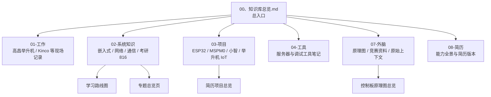
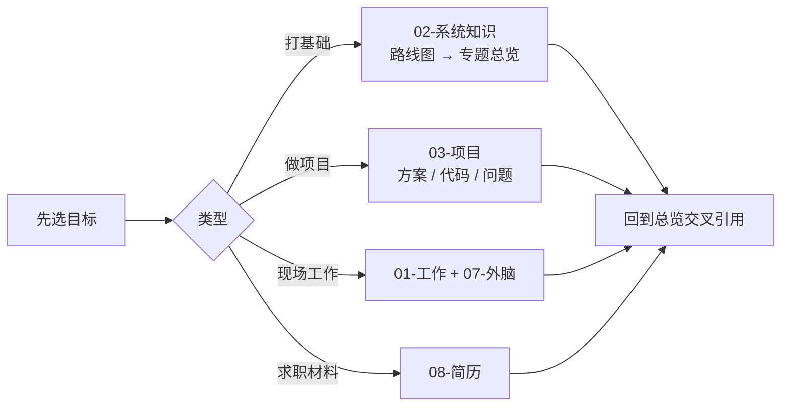

# Obsidian_Knowledge_Vault

个人 Obsidian 知识库：嵌入式学习主线、项目笔记、工作交接与简历材料。

本仓库是笔记源，不是固件工程。入口笔记：`00、知识库总览.md`。

## 知识库架构图



## 使用路径框图



## 目录说明

| 目录 | 用途 |
|------|------|
| `01-工作` | 高昌举升机等工作记录与交接 |
| `02-系统知识（看的少）` | 可复用基础：嵌入式、网络、协议、考研 |
| `03-项目` | 项目方案、实现与问题反查 |
| `04-工具` | 服务器、调试工具 |
| `07-外脑` | 正在使用的资料与结论，保留原始上下文 |
| `08-简历` | 能力全景与简历文稿 |
| `.obsidian` | Obsidian 工作区配置 |

## 阅读约定

- 系统知识用于建立可复用能力；项目笔记记录实际问题，宜与专题对照阅读。
- 每个专题目录以「总览」笔记为入口，避免只靠文件名搜索。
- 外脑笔记优先保持原始上下文，勿过早抽象成空泛总结。

## 远程

```text
origin → https://github.com/linxi27667/Obsidian_Knowledge_Vault.git
```

本地常见路径：`C:\Users\30817\Documents\Obsidian Vault`
